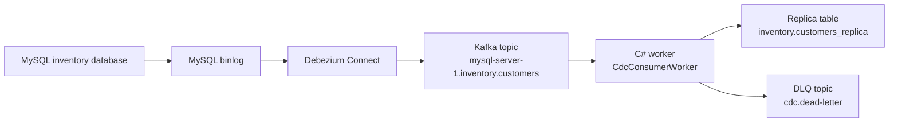

# Architecture

This document summarizes the architecture for the local CDC pipeline. For message-level flow details, see [cdc-flow.md](cdc-flow.md).

## 1. Architectural Characteristics

### Data Consistency

The system processes Kafka messages in order and only marks a message as completed after the business logic succeeds, so messages can be safely retried or replayed if failures happen. The consumer commits an offset only after the change has either been applied to the replica table or moved to the dead-letter topic.

### Recoverability

Kafka provides durable event storage and consumer group offsets. The C# worker retries failed message processing before publishing poison messages to `cdc.dead-letter`, allowing the pipeline to keep moving while preserving failed payloads for later inspection.

### Observability

Operational visibility comes from the demo web app, container logs, Kafka UI, Kafka Connect connector status, and the dead-letter topic. The worker logs processing failures, retry attempts, and DLQ publication events.

### Deployability

The runtime is packaged as a Docker Compose stack with MySQL, Kafka, Debezium Connect, connector registration, Kafka UI, and the C# worker. This keeps the demo environment reproducible and easy to tear down.

### Extensibility

The consumer separates parsing, dispatching, business handling, and persistence behind interfaces. New tables can be added by introducing record contracts and change handlers, then routing the matching topic or envelope to those handlers.

### Scalability

Kafka decouples capture from processing. Additional consumer instances can share work through the configured consumer group when topic partitioning supports it. The current Debezium connector runs with `tasks.max` set to `1`, which is appropriate for the single MySQL source in this demo.

## 2. Architectural Decisions

### Use Debezium For MySQL CDC

Debezium reads MySQL binlog changes and publishes them to Kafka topics. This avoids application-level polling and keeps the source database as the system of record.

### Use Kafka As The Event Backbone

Kafka buffers CDC events between capture and processing. It provides durable topics, ordered partitions, consumer group offsets, and replay capability for local recovery and debugging.

### Use JSON Debezium Envelopes Without Kafka Connect Schemas

Kafka Connect is configured with JSON converters and schema output disabled. This keeps event payloads simple for the C# demo consumer while preserving the Debezium `before`, `after`, `source`, and `op` envelope fields.

### Commit Offsets After Processing

The consumer uses manual offset handling:

```text
consume -> parse -> dispatch -> handle -> commit
```

If processing fails repeatedly, the message is sent to `cdc.dead-letter` and then committed. This prevents one bad message from blocking the topic forever while retaining enough context to investigate the failure.

### Keep Table-Specific Logic In Handlers

`ChangeDispatcher` routes parsed change events to table-specific handlers. `CustomerChangeHandler` owns customer semantics and delegates persistence to `MySqlReplicaCustomerStore`.

### Keep Infrastructure Behind Interfaces

Kafka consumption, DLQ publishing, parsing, dispatching, and replica persistence are registered through interfaces in `consumer/Program.cs`. This keeps application logic testable and reduces coupling to external infrastructure.

### Keep The Demo As A Separate Facade

The demo web app observes and triggers the pipeline through public runtime boundaries: MySQL, Kafka, and Kafka Connect. It does not replace Debezium or the worker, so the browser experience demonstrates the same flow used by the repository.

## 3. Architectural Style

The system uses an event-driven CDC pipeline style.



The worker follows a layered service style:

- Contracts define transport-neutral event and record models.
- Application services parse Debezium envelopes and dispatch changes.
- Handlers apply table-specific behavior.
- Infrastructure adapters connect to Kafka and MySQL.

The flow also behaves like a pipe-and-filter system: each stage accepts a clear input, performs one responsibility, and passes the result to the next stage.

## 4. Logical Components

| Component | Responsibility | Main Files |
| --- | --- | --- |
| Source database | Stores authoritative `inventory.customers` rows and emits binlog changes. | `deploy/mysql-init/01-seed.sql` |
| Replica database table | Stores the consumer-maintained projection of customer rows. | `deploy/mysql-init/02-replica.sql` |
| Debezium connector | Reads MySQL binlog events and publishes Debezium envelopes to Kafka. | `deploy/connectors/mysql-inventory.config.json` |
| Kafka broker | Hosts the CDC topic, consumer offsets, Kafka Connect internal topics, and DLQ topic. | `deploy/docker-compose.yml` |
| Connector init | Registers or updates the Debezium connector during Compose startup. | `deploy/docker-compose.yml`, `deploy/scripts/register-connectors.ps1` |
| Replica bootstrap | Reconciles the replica table from current source rows before the consumer starts, giving the demo a consistent baseline even when old offsets exist. | `deploy/docker-compose.yml` |
| Worker host | Starts the .NET worker and registers dependencies. | `consumer/Program.cs` |
| Consumer worker | Runs the hosted background service. | `consumer/Infrastructure/Kafka/CdcConsumerWorker.cs` |
| Kafka consumer loop | Consumes messages, retries failures, commits offsets, and publishes DLQ messages. | `consumer/Infrastructure/Kafka/KafkaConsumerLoop.cs` |
| Envelope parser | Converts raw Debezium JSON into typed `ChangeEvent<T>` values. | `consumer/Application/DebeziumEnvelopeParser.cs` |
| Change dispatcher | Routes parsed changes to the correct handler. | `consumer/Application/ChangeDispatcher.cs` |
| Customer handler | Applies customer create, update, delete, snapshot, and truncate events. | `consumer/Application/Customers/CustomerChangeHandler.cs` |
| Replica store | Executes MySQL upsert, delete, and truncate operations for the replica table. | `consumer/Infrastructure/ReplicaDb/MySqlReplicaCustomerStore.cs` |
| Dead-letter producer | Publishes failed messages and error metadata to `cdc.dead-letter`. | `consumer/Infrastructure/Kafka/KafkaDeadLetterProducer.cs` |
| Demo web app | Lets users trigger source changes, publish poison events, inspect Kafka messages, compare source and replica rows, and map runtime stages to repo files. | `demo/DemoWeb/*` |
| Tests | Verifies parser behavior for Debezium event shapes. | `tests/CdcConsumer.Tests/DebeziumEnvelopeParserTests.cs` |
