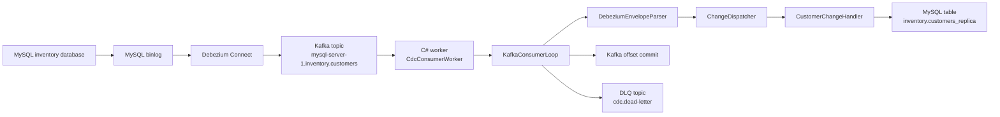
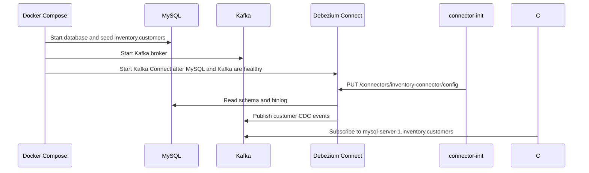

# CDC Flow

This repository runs a local CDC pipeline that captures row changes from MySQL, publishes them to Kafka through Debezium, and processes them with a C# worker service that also maintains a replica table in MySQL.

```text
MySQL inventory.customers
  -> MySQL binlog
  -> Debezium MySQL connector
  -> Kafka topic mysql-server-1.inventory.customers
  -> C# consumer worker
  -> CustomerChangeHandler
  -> MySQL inventory.customers_replica
```

## Component Flow



## Startup Flow



The startup wiring lives in `deploy/docker-compose.yml`.

Important services:

- `mysql`: source database seeded by `deploy/mysql-init/01-seed.sql`
- `kafka`: local Kafka broker
- `connect`: Debezium Kafka Connect runtime
- `connector-init`: registers or updates the Debezium connector
- `consumer`: C# worker that reads CDC events
- `kafka-ui`: browser UI at http://localhost:8080

## Connector Flow

The connector config is in `deploy/connectors/mysql-inventory.config.json`.

Key settings:

- `connector.class`: uses Debezium's MySQL connector
- `database.hostname`: points to the Compose service named `mysql`
- `topic.prefix`: `mysql-server-1`
- `database.include.list`: captures only the `inventory` database
- `include.schema.changes`: disabled, so the consumer receives table row events only

For the `inventory.customers` table, Debezium publishes to:

```text
mysql-server-1.inventory.customers
```

The topic name comes from:

```text
{topic.prefix}.{database}.{table}
```

## Event Flow

When this SQL runs:

```sql
UPDATE customers
SET email = 'john.new@example.com'
WHERE first_name = 'John' AND last_name = 'Doe';
```

MySQL writes the row change to its binlog. Debezium reads the binlog and emits a Kafka message with a Debezium envelope:

```json
{
  "before": {
    "id": 3,
    "first_name": "John",
    "last_name": "Doe",
    "email": "john.doe@example.com"
  },
  "after": {
    "id": 3,
    "first_name": "John",
    "last_name": "Doe",
    "email": "john.new@example.com"
  },
  "source": {
    "db": "inventory",
    "table": "customers"
  },
  "op": "u",
  "ts_ms": 1710000001000
}
```

Operation codes:

- `c`: create
- `u`: update
- `d`: delete
- `r`: snapshot read
- `t`: truncate
- `null` message value: tombstone

## Consumer Processing Flow

The consumer starts in `consumer/Program.cs` and wires the app with dependency injection.

```mermaid
sequenceDiagram
    participant Kafka as Kafka
    participant Loop as KafkaConsumerLoop
    participant Parser as DebeziumEnvelopeParser
    participant Dispatcher as ChangeDispatcher
    participant Handler as CustomerChangeHandler
    participant Replica as inventory.customers_replica
    participant DLQ as cdc.dead-letter

    Kafka->>Loop: Consume message
    Loop->>Parser: Parse Debezium envelope
    Parser->>Loop: ChangeEvent<CustomerRecord>
    Loop->>Dispatcher: Dispatch message
    Dispatcher->>Handler: Handle customer change
    Handler->>Replica: Upsert/Delete/Truncate
    Handler->>Loop: Success
    Loop->>Kafka: Store and commit offset

    alt processing fails repeatedly
        Loop->>DLQ: Publish DeadLetterMessage
        Loop->>Kafka: Store and commit offset
    end
```

Runtime responsibilities:

- `CdcConsumerWorker`: hosted background service entrypoint
- `KafkaConsumerLoop`: consumes Kafka messages, retries processing, commits offsets, publishes DLQ messages
- `DebeziumEnvelopeParser`: converts Debezium JSON into typed `ChangeEvent<T>`
- `ChangeDispatcher`: routes parsed events to the right handler
- `CustomerChangeHandler`: handles `CustomerRecord` create, update, delete, snapshot, and truncate events
- `MySqlReplicaCustomerStore`: persists CDC operations into `inventory.customers_replica`
- `KafkaDeadLetterProducer`: publishes poison messages to `cdc.dead-letter`

## Offset And Retry Behavior

The consumer uses manual offset commits.

```text
consume -> parse -> handle -> commit offset
```

If handling fails:

```text
consume -> parse or handle fails -> retry -> retry -> DLQ -> commit offset
```

This matters because Kafka should only advance the consumer group's offset after the app has either handled the event or intentionally moved it to the dead-letter topic.

Configuration lives in `consumer/appsettings.json` and can be overridden through Compose environment variables:

- `Kafka__BootstrapServers`
- `Kafka__Topic`
- `Kafka__GroupId`
- `Kafka__DeadLetterTopic`
- `Kafka__RetryDelaySeconds`
- `Kafka__MaxProcessingAttempts`
- `Kafka__EnableDeadLetterTopic`
- `ReplicaDb__ConnectionString`

## How To Trace One Change

1. Start the stack:

   ```bash
   docker compose -f deploy/docker-compose.yml up -d --build
   ```

2. Insert or update a customer:

   ```bash
   docker exec -it mysql mysql -uroot -pdebezium
   ```

   ```sql
   USE inventory;

   INSERT INTO customers(first_name, last_name, email)
   VALUES ('John', 'Doe', 'john.doe@example.com');
   ```

3. Watch the consumer:

   ```bash
   docker logs -f consumer
   ```

4. Inspect the Kafka topic in Kafka UI:

   ```text
   http://localhost:8080
   ```

5. Check replica table rows:

   ```bash
   docker exec -it mysql mysql -uroot -pdebezium -e "SELECT * FROM inventory.customers_replica;"
   ```

6. Check connector health:

   ```bash
   curl http://localhost:8083/connectors/inventory-connector/status
   ```

## File Map

```text
deploy/docker-compose.yml
  Defines MySQL, Kafka, Debezium Connect, connector init, Kafka UI, and the consumer.

deploy/connectors/mysql-inventory.config.json
  Debezium MySQL connector config used by connector-init.

deploy/mysql-init/01-seed.sql
  Creates and seeds inventory.customers.

deploy/mysql-init/02-replica.sql
  Creates inventory.customers_replica used by the consumer write model.

consumer/Program.cs
  Builds the worker host and registers services.

consumer/Infrastructure/Kafka/KafkaConsumerLoop.cs
  Owns consuming, retrying, DLQ publishing, and offset commits.

consumer/Application/DebeziumEnvelopeParser.cs
  Parses raw Debezium JSON into typed change events.

consumer/Application/ChangeDispatcher.cs
  Routes parsed events to application handlers.

consumer/Application/Customers/CustomerChangeHandler.cs
  Handles customer-specific CDC events and applies them to replica storage.

consumer/Infrastructure/ReplicaDb/MySqlReplicaCustomerStore.cs
  Executes upsert/delete/truncate SQL against inventory.customers_replica.

consumer/Contracts/*
  Shared event, operation, Debezium, and customer models.
```
