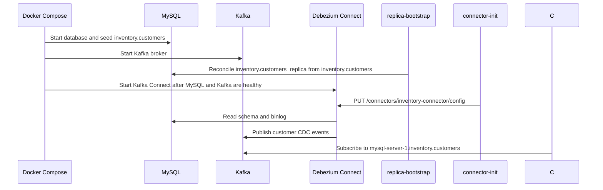

# CDC Flow

This document follows the runtime flow of one customer-table change through the local CDC pipeline. For architecture characteristics, decisions, style, and logical components, see [architecture.md](architecture.md).

## Startup Flow



The startup sequence is defined in `deploy/docker-compose.yml`.

## Connector Flow

The connector config is in `deploy/connectors/mysql-inventory.config.json`.

Key settings:

- `connector.class`: uses Debezium's MySQL connector
- `database.hostname`: points to the Compose service named `mysql`
- `topic.prefix`: `mysql-server-1`
- `database.include.list`: captures only the `inventory` database
- `include.schema.changes`: disabled, so the consumer receives table row events only

For the `inventory.customers` table, Debezium publishes to:

```text
mysql-server-1.inventory.customers
```

The topic name comes from:

```text
{topic.prefix}.{database}.{table}
```

## Event Flow

When this SQL runs:

```sql
UPDATE customers
SET email = 'john.new@example.com'
WHERE first_name = 'John' AND last_name = 'Doe';
```

MySQL writes the row change to its binlog. Debezium reads the binlog and emits a Kafka message with a Debezium envelope:

```json
{
  "before": {
    "id": 3,
    "first_name": "John",
    "last_name": "Doe",
    "email": "john.doe@example.com"
  },
  "after": {
    "id": 3,
    "first_name": "John",
    "last_name": "Doe",
    "email": "john.new@example.com"
  },
  "source": {
    "db": "inventory",
    "table": "customers"
  },
  "op": "u",
  "ts_ms": 1710000001000
}
```

Operation codes:

- `c`: create
- `u`: update
- `d`: delete
- `r`: snapshot read
- `t`: truncate
- `null` message value: tombstone

## Consumer Processing Flow

After the worker consumes a Kafka message, it parses the Debezium envelope, dispatches the typed change event, applies the replica update, and then stores and commits the Kafka offset.

```mermaid
sequenceDiagram
    participant Kafka as Kafka
    participant Loop as KafkaConsumerLoop
    participant Parser as DebeziumEnvelopeParser
    participant Dispatcher as ChangeDispatcher
    participant Handler as CustomerChangeHandler
    participant Replica as inventory.customers_replica
    participant DLQ as cdc.dead-letter

    Kafka->>Loop: Consume message
    Loop->>Parser: Parse Debezium envelope
    Parser->>Loop: ChangeEvent<CustomerRecord>
    Loop->>Dispatcher: Dispatch message
    Dispatcher->>Handler: Handle customer change
    Handler->>Replica: Upsert/Delete/Truncate
    Handler->>Loop: Success
    Loop->>Kafka: Store and commit offset

    alt processing fails repeatedly
        Loop->>DLQ: Publish DeadLetterMessage
        Loop->>Kafka: Store and commit offset
    end
```

## Runtime Configuration

Configuration lives in `consumer/appsettings.json` and can be overridden through Compose environment variables:

- `Kafka__BootstrapServers`
- `Kafka__Topic`
- `Kafka__GroupId`
- `Kafka__DeadLetterTopic`
- `Kafka__RetryDelaySeconds`
- `Kafka__MaxProcessingAttempts`
- `Kafka__EnableDeadLetterTopic`
- `ReplicaDb__ConnectionString`

## How To Trace One Change

1. Start the stack:

   ```bash
   docker compose -f deploy/docker-compose.yml up -d --build
   ```

2. Open the demo web app:

   ```text
   http://localhost:5173
   ```

3. Use the web app Actions panel to insert, update, delete, truncate, seed, or publish a poison event.

4. Or insert/update a customer manually:

   ```bash
   docker exec -it mysql mysql -uroot -pdebezium
   ```

   ```sql
   USE inventory;

   INSERT INTO customers(first_name, last_name, email)
   VALUES ('John', 'Doe', 'john.doe@example.com');
   ```

5. Watch the consumer:

   ```bash
   docker logs -f consumer
   ```

6. Inspect the Kafka topic in Kafka UI:

   ```text
   http://localhost:8080
   ```

7. Check replica table rows:

   ```bash
   docker exec -it mysql mysql -uroot -pdebezium -e "SELECT * FROM inventory.customers_replica;"
   ```

8. Check connector health:

   ```bash
   curl http://localhost:8083/connectors/inventory-connector/status
   ```
